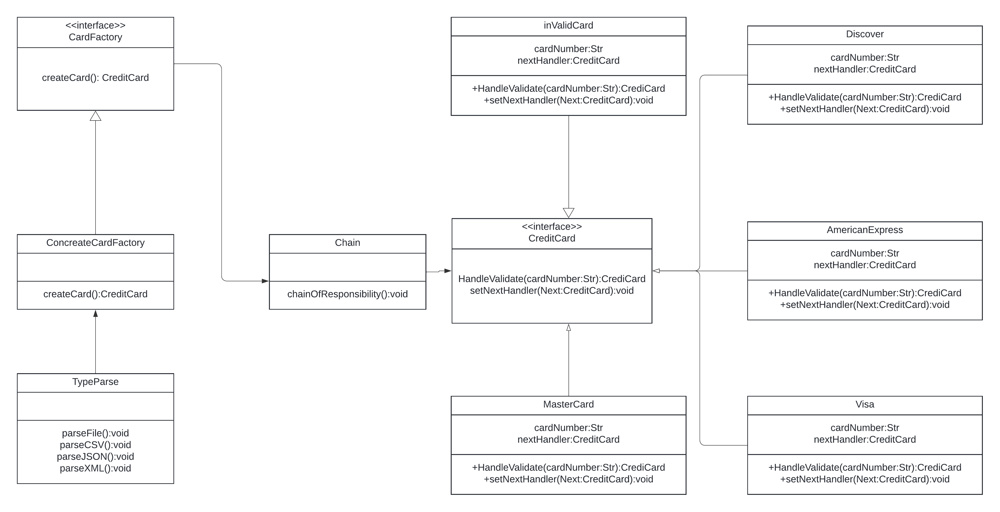

### Project Description:
You have a CSV file that contains credit card  records. Each record is on a line. It contains a field for the card number, the expiration date, and the name of the card holder. The fields are comma-separated.  In your system you have the following class structure for the credit cards:

a class CreditCard,

classes VisaCC, MasterCC, AmExCC that are all subclasses of CreditCard,

you can assume more subclasses for other credit card types will be added later on.

You now have to design the method(s) (and maybe additional classes) that  reads a record from the file, verifies that the credit card number is a valid account number, and creates an instance of the appropriate credit card class.  

Important details: Credit card numbers cannot exceed 19.  You can determine the card issuer based on the credit card number:

MasterCard

First digit is a 5, second digit is in range 1 through 5 inclusive. Only valid length of number is 16 digits.

Visa: First digit is a 4. Length is either 13 or 16 digits.

AmericanExpress: First digit is a 3 and second digit a 4 or 7. Length is 15 digits.

Discover: First four digits are 6011. Length is 16 digits.

### Requirement:

```
Download latest JDK: https://www.oracle.com/java/technologies/downloads/
```

### Run the Program

Specify the input file path and output file path in run.sh by:
```
    java -cp "$classpath;./out" Main <input file path> <out put file path>
```
cd to project root directory, and run
```
    ./run.sh
```

to run test, cd to root directory and run
```
    ./runTest.sh
```


